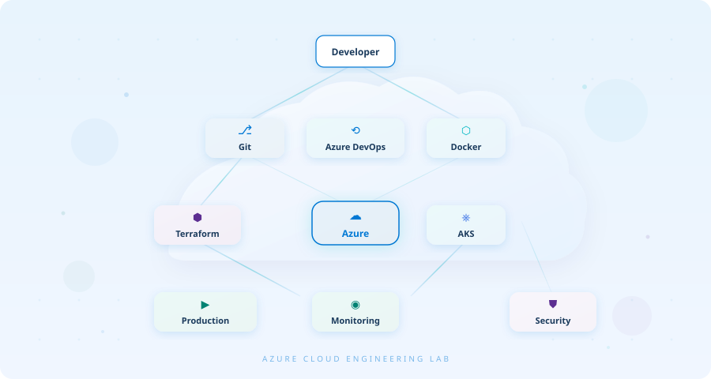
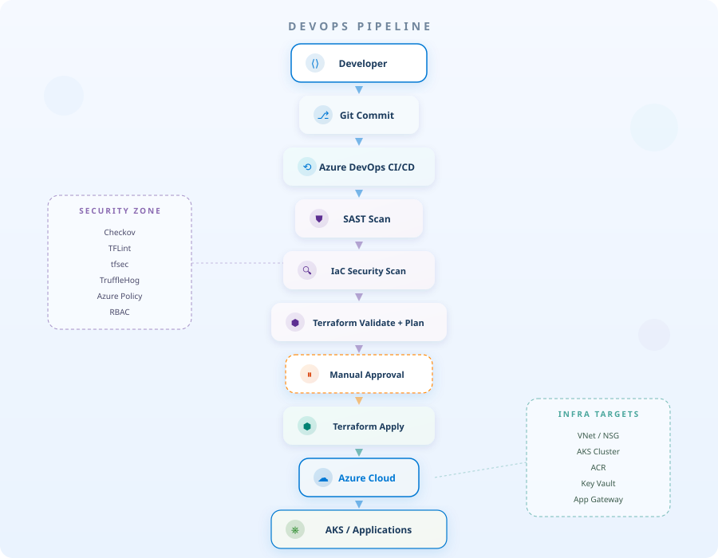
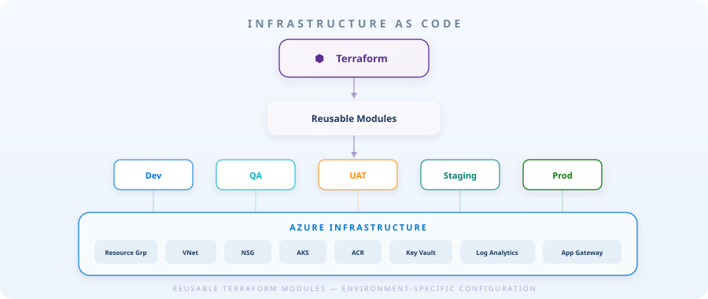
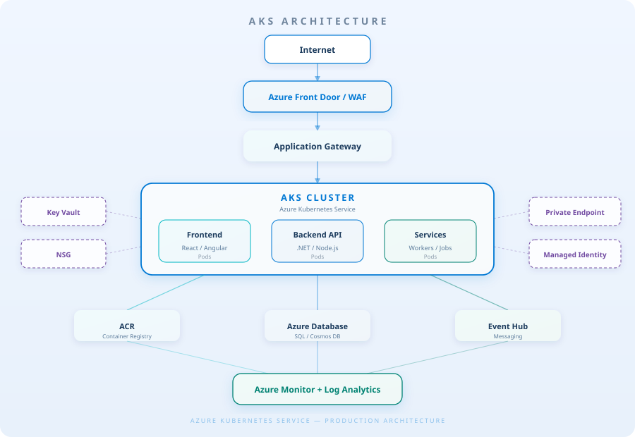
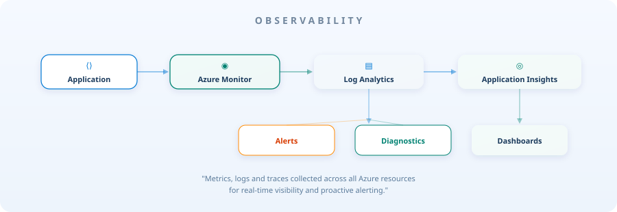

<!-- ============================================ -->
<!-- HERO SECTION -->
<!-- ============================================ -->

 

  

  

# **RAJU KUMAR SINGH**

### Azure DevOps Engineer

 

*Building scalable Azure infrastructure, automated CI/CD pipelines*
*and production-ready cloud platforms.*

 

 

<!-- ============================================ -->
<!-- ABOUT ME -->
<!-- ============================================ -->

## ☁️ About Me

I am an Azure DevOps Engineer with around 5.7 years of experience working with cloud infrastructure, Infrastructure as Code, CI/CD automation and Azure services. I focus on building reliable, reusable and secure deployment platforms using Azure, Terraform, Azure DevOps and Kubernetes.

My day-to-day involves writing Terraform modules, designing CI/CD pipelines in Azure DevOps, managing AKS clusters and ensuring that infrastructure is deployed consistently, securely and with proper observability from day one.

 

 

<!-- ============================================ -->
<!-- TECHNOLOGY CLOUD -->
<!-- ============================================ -->

## 🧰 Technology Cloud

 

<table>
<tr>
<td align="center" width="150">

**☁️ Cloud**

 

`Microsoft Azure`

</td>
<td align="center" width="150">

**🏗️ Infrastructure**

 

`Terraform`
`ARM / Bicep`

</td>
<td align="center" width="150">

**⟲ CI/CD**

 

`Azure DevOps`
`Git`

</td>
<td align="center" width="150">

**📦 Containers**

 

`Docker`
`Kubernetes`
`AKS`

</td>
</tr>
<tr>
<td align="center" width="150">

**🔐 Security**

 

`Key Vault`
`RBAC`
`Azure Policy`
`Checkov`
`TFLint`
`tfsec`
`TruffleHog`

</td>
<td align="center" width="150">

**📊 Monitoring**

 

`Azure Monitor`
`Log Analytics`
`App Insights`

</td>
<td align="center" width="150">

**⚙️ Automation**

 

`PowerShell`
`Bash`

</td>
<td align="center" width="150">

**🌐 Networking**

 

`VNet / NSG`
`App Gateway`
`Front Door`
`Private Endpoint`

</td>
</tr>
</table>

 

 

<!-- ============================================ -->
<!-- DEVOPS PIPELINE -->
<!-- ============================================ -->

## ⟲ DevOps Pipeline

 

  

> Every deployment follows a structured pipeline — from code commit through security scans,
> infrastructure validation, manual approval and finally provisioning into Azure.

 

 

<!-- ============================================ -->
<!-- INFRASTRUCTURE AS CODE -->
<!-- ============================================ -->

## 🏗️ Infrastructure as Code

 

  

> Reusable Terraform modules with environment-specific configuration for consistent Azure infrastructure.
> Each environment — Dev, QA, UAT, Staging, Prod — is provisioned from the same module set
> with different variable files, ensuring parity across all stages.

 

 

<!-- ============================================ -->
<!-- AKS ARCHITECTURE -->
<!-- ============================================ -->

## ⎈ AKS Architecture

 

  

> Production Kubernetes architecture on AKS — traffic flows from Azure Front Door through
> Application Gateway into the cluster, with workloads split across frontend, backend and
> service pods. Supporting services include ACR, Azure Database, Event Hub and
> full observability via Azure Monitor.

 

 

<!-- ============================================ -->
<!-- FEATURED PROJECTS -->
<!-- ============================================ -->

## 📂 Featured Projects

 

<table>
<tr>
<td width="33%" valign="top">

### 01 — [Terraform Infrastructure](https://github.com/Raju089-ui/Terraform_infra)

Infrastructure as Code repository using Terraform to provision and manage Azure cloud resources. Includes modular, reusable Terraform code for virtual machines, networking and scalable infrastructure.

 

`Azure` `Terraform` `HCL` `IaC` `DevOps`

</td>
<td width="33%" valign="top">

### 02 — [AKS Infrastructure](https://github.com/Raju089-ui/aks_infra)

Azure Kubernetes Service infrastructure provisioned through Terraform — covering AKS cluster setup, networking and cloud resource management.

 

`Azure` `Terraform` `AKS` `Kubernetes` `HCL`

</td>
<td width="33%" valign="top">

### 03 — [K8s Supply Chain Lab](https://github.com/Raju089-ui/k8s-supply-chain-lab)

Build, scan, sign, and refuse unsigned container images at admission. A hands-on Kubernetes supply chain security lab.

 

`Kubernetes` `Docker` `Security` `Cosign` `Supply Chain`

</td>
</tr>
</table>

 

 

<!-- ============================================ -->
<!-- SECURITY -->
<!-- ============================================ -->

## 🔐 Secure by Design

 

> Security checks are integrated into infrastructure and delivery workflows
> to identify configuration and IaC risks before deployment.

 

<table>
<tr>
<td align="center" width="130">

🔑
**Key Vault**

Secrets & Certs

</td>
<td align="center" width="130">

🛡️
**RBAC**

Access Control

</td>
<td align="center" width="130">

🔒
**Private Endpoints**

Network Isolation

</td>
<td align="center" width="130">

📜
**Azure Policy**

Governance

</td>
</tr>
<tr>
<td align="center" width="130">

🔍
**Checkov**

IaC Scanning

</td>
<td align="center" width="130">

🔍
**TFLint**

Terraform Lint

</td>
<td align="center" width="130">

🔍
**tfsec**

Security Analysis

</td>
<td align="center" width="130">

🔍
**TruffleHog**

Secret Detection

</td>
</tr>
</table>

 

 

<!-- ============================================ -->
<!-- OBSERVABILITY -->
<!-- ============================================ -->

## 📊 Observability

 

  

 

<!-- ============================================ -->
<!-- CURRENT FOCUS -->
<!-- ============================================ -->

## 🧭 Currently Exploring

 

<table>
<tr>
<td align="center" width="130">

☁️
**Advanced Azure**

Multi-region &
Landing Zones

</td>
<td align="center" width="130">

🏗️
**Enterprise Terraform**

Module Registry &
State Management

</td>
<td align="center" width="130">

⎈
**Kubernetes / AKS**

Service Mesh &
GitOps

</td>
<td align="center" width="130">

🚀
**CI/CD Automation**

Multi-stage &
Template Pipelines

</td>
</tr>
<tr>
<td align="center" width="130">

🔐
**Cloud Security**

Zero Trust &
Policy as Code

</td>
<td align="center" width="130">

📊
**Observability**

Full-stack
Monitoring

</td>
<td align="center" width="130">

💰
**FinOps**

Cost Optimization
& Governance

</td>
<td align="center" width="130">

🐧
**Linux**

Administration &
Hardening

</td>
</tr>
</table>

 

 

<!-- ============================================ -->
<!-- GITHUB ACTIVITY -->
<!-- ============================================ -->

## 📈 GitHub Activity

  

&nbsp;&nbsp;

  

 

<!-- ============================================ -->
<!-- CONNECT -->
<!-- ============================================ -->

## 🤝 Let's Connect

 

&nbsp;&nbsp;

  

<!-- ============================================ -->
<!-- FOOTER -->
<!-- ============================================ -->

  

**`Build → Automate → Secure → Observe → Improve`**

 

`Azure` · `Terraform` · `DevOps` · `Kubernetes`

 

Designed as an Azure Cloud Engineering Lab — where infrastructure meets automation.

  

