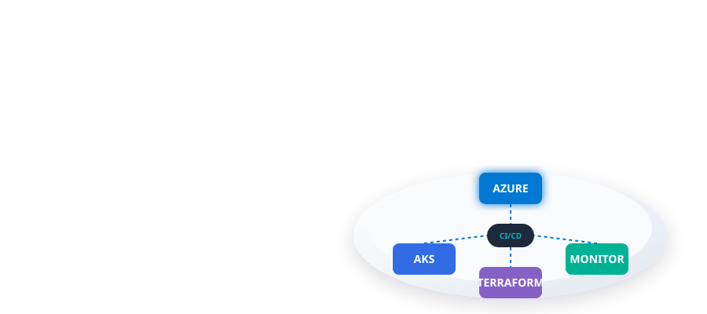
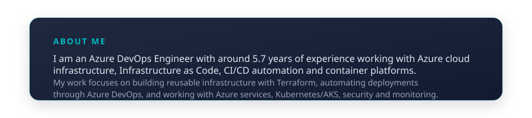
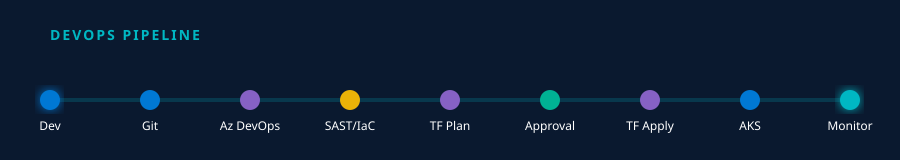

  

  

## ⚙️ TECHNOLOGY STACK

  

  

## 🚀 FEATURED ENGINEERING PROJECTS

 

### 01 — [Terraform Infrastructure](https://github.com/Raju089-ui/Terraform_infra)
**Terraform AKS Enterprise Infrastructure**  
Reusable Terraform modules for enterprise Azure AKS infrastructure including networking, NSGs, AKS, ACR, Key Vault, Log Analytics and Application Gateway.
 `Azure` `Terraform` `AKS` `ACR` `Key Vault` `Azure Monitor`

### 02 — BharatNet / Telecom WAR-ROOM
**Azure DevOps Infrastructure**  
Azure-based application deployment and DevOps infrastructure for a large-scale telecom connectivity monitoring platform.
 `Azure` `App Service` `Front Door` `AKS` `Event Hub` `Cosmos DB`

### 03 — [Azure Infrastructure Automation](https://github.com/Raju089-ui/Terraform-Azure-Lifecycle-Demo)
**Consistent Deployment Patterns**  
Reusable Terraform and Azure DevOps patterns for consistent infrastructure deployment across environments.
 `Terraform` `Azure DevOps` `CI/CD`

  

## 📈 GITHUB ACTIVITY

<picture>
  <source media="(prefers-color-scheme: dark)" srcset="./profile-3d/dashboard-dark.svg">
  <source media="(prefers-color-scheme: light)" srcset="./profile-3d/dashboard-light.svg">
  
</picture>

  

&nbsp;&nbsp;

  

## 🎯 CURRENT FOCUS

☁ Advanced Azure &nbsp;&nbsp;|&nbsp;&nbsp; 🏗 Enterprise Terraform &nbsp;&nbsp;|&nbsp;&nbsp; ☸ Kubernetes / AKS &nbsp;&nbsp;|&nbsp;&nbsp; 🚀 CI/CD &nbsp;&nbsp;|&nbsp;&nbsp; 🔐 Cloud Security

  

  
<strong>BUILD • AUTOMATE • SECURE • OBSERVE</strong>

  
<em>Azure • Terraform • DevOps • Kubernetes</em>

