<picture>
  <source media="(prefers-color-scheme: dark)" srcset="./profile-3d/hero-dark.svg">
  <source media="(prefers-color-scheme: light)" srcset="./profile-3d/hero.svg">
  
</picture>

  

<picture>
  <source media="(prefers-color-scheme: dark)" srcset="./profile-3d/stack-dark.svg">
  <source media="(prefers-color-scheme: light)" srcset="./profile-3d/stack.svg">
  
</picture>

  

<picture>
  <source media="(prefers-color-scheme: dark)" srcset="./profile-3d/pipeline-dark.svg">
  <source media="(prefers-color-scheme: light)" srcset="./profile-3d/pipeline.svg">
  
</picture>

  

<picture>
  <source media="(prefers-color-scheme: dark)" srcset="./profile-3d/projects-dark.svg">
  <source media="(prefers-color-scheme: light)" srcset="./profile-3d/projects.svg">
  
</picture>

  <a href="https://github.com/Raju089-ui/Terraform_infra">Terraform AKS Infrastructure</a>
  &nbsp;·&nbsp;
  <a href="https://github.com/Raju089-ui/k8s-supply-chain-lab">K8s Supply Chain Lab</a>
  &nbsp;·&nbsp;
  <a href="https://github.com/Raju089-ui/Terraform-Azure-Lifecycle-Demo">Azure Lifecycle Automation</a>

 

<picture>
  <source media="(prefers-color-scheme: dark)" srcset="./profile-3d/dashboard-dark.svg">
  <source media="(prefers-color-scheme: light)" srcset="./profile-3d/dashboard-light.svg">
  
</picture>

  

<picture>
  <source media="(prefers-color-scheme: dark)" srcset="./profile-3d/focus-dark.svg">
  <source media="(prefers-color-scheme: light)" srcset="./profile-3d/focus.svg">
  
</picture>

<!--
  Every panel above is generated, not hand-drawn.

    profile.config.json          what the panels say
    scripts/isokit.py            isometric projection, solids, palette
    scripts/build_profile_3d.py  hero / stack / pipeline / projects / focus
    scripts/generate_3d_dashboard.py  the live activity dashboard

  Edit the config, push, and the Action re-renders both themes.
  It also re-renders on its own every morning at 06:00 IST.
-->
